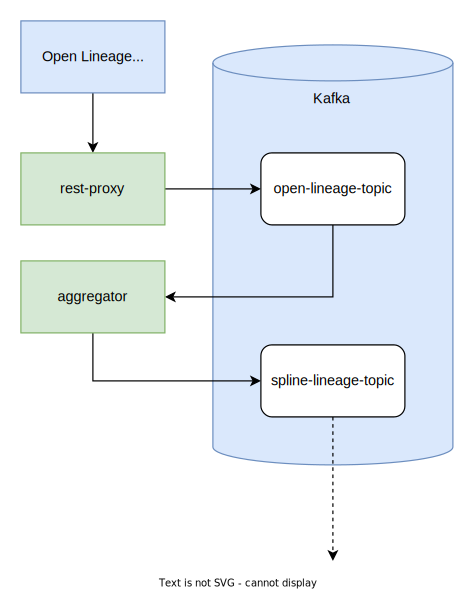
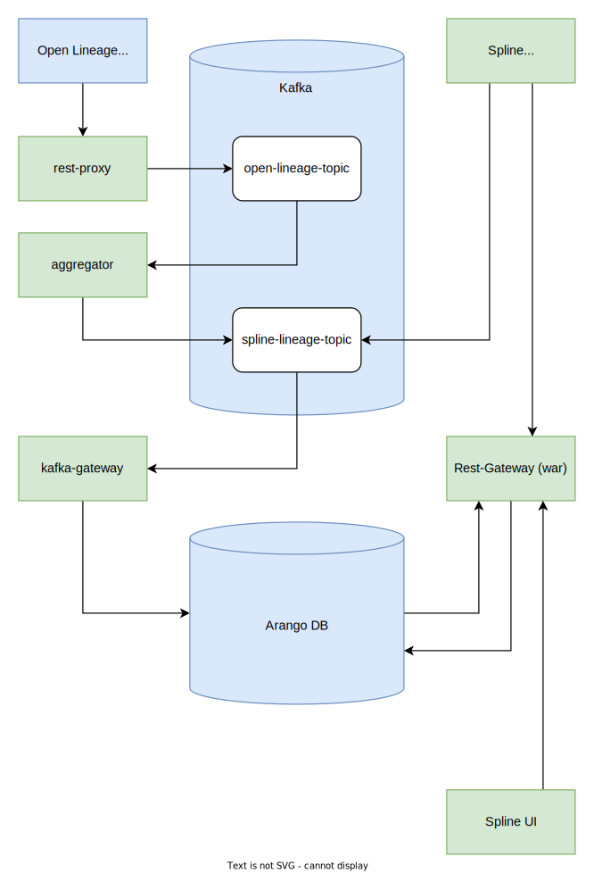

# Spline OpenLineage Integration
Applications in this repo provide a way to send an **open lineage** messages into **spline server**.


- **rest-proxy** provides rest open lineage api and inserts all messages directly to kafka
- **aggregator** consumes the messages form kafka and merges all messages for one run. 
Once the `COMPLETE` message arrives all the data are converted into one Spline Plan and one Event message. 
In the last step messages are inserted into another kafka topic where they can be consumed by spline kafka server.

### Architecture



### Architecture with rest of Spline components



### Hwo To Build
Building artifacts jar/war
```bash
mvn clean package
```

Building docker images
```bash
mvn clean install -Pdocker -Ddockerfile.repositoryUrl=my
```

### Docker Compose
There are two docker-compose files to make it easy to experiment with the project:
The one in `docker/ol-integration/` will create environment and start artifacts from this repo only.
The other one `docker/ol-integration-and-spline` will start the whole Spline pipeline from open lineage message ingestion to spline ui at the end.

### How To Run
#### Prerequisities
- Running kafka broker, for this example it is on `localhost:9092`
- Two kafka topics (one for messages in open lineage format and one for messages in spline format). 
For this example it will be `open-lineage-topic` and `spline-lineage-topic`

#### Runing in docker
For rest endpoint I have to map the port so I am able to acces it outside of docker and also set the open lineage topic and addres of kafka broker. 
It's important to replace localhost for appropriate address that works from inside the container. For macOS it is `host.docker.internal`.

```
docker run -p 8086:8080 \
    -e JAVA_OPTS="-Dspline.ol.topic=open-lineage-topic -Dspline.ol.producer.bootstrap.servers=host.docker.internal:9092" \
    my/spline-open-lineage-rest-proxy
```

```
docker run \
    -e JAVA_OPTS="-Dspline.ol.inputTopic=open-lineage-topic -Dspline.ol.outputTopic=spline-lineage-topic -Dspline.ol.streams.bootstrap.servers=host.docker.internal:9092" \
    my/spline-open-lineage-aggregator
```
